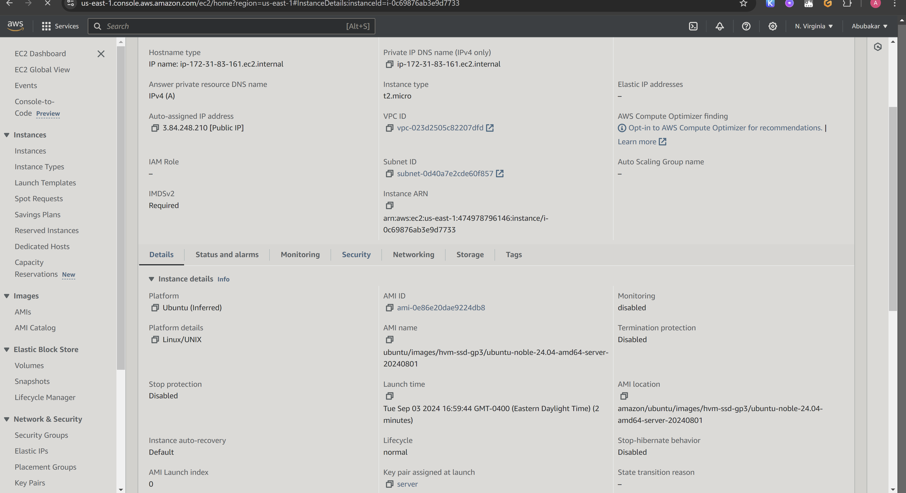
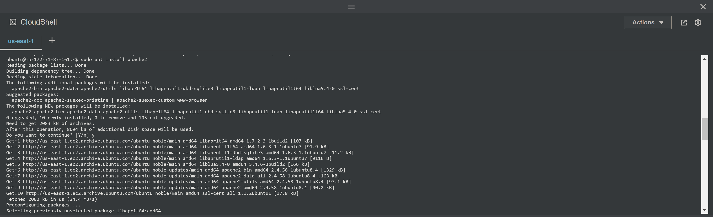
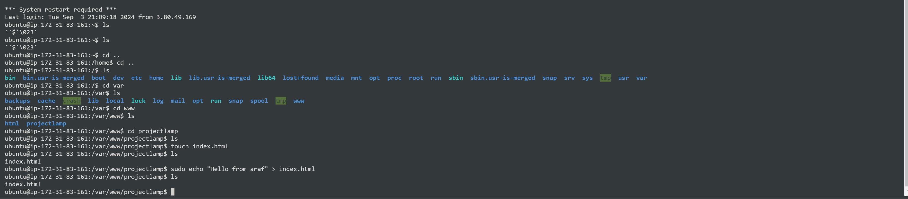
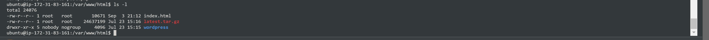

# Setuping  WordPress Website Using LAMP Stack
==============================================
Setting up a WordPress website using the LAMP stack (Linux, Apache, MySQL, PHP) is a powerful way to create a robust and scalable web presence. This project will guide you through each step of the process, from setting up your server environment to installing WordPress and configuring it for optimal performance. Whether you're a seasoned developer or a beginner, this tutorial will provide you with the knowledge and skills needed to deploy a fully functional WordPress site. By the end of this guide, you'll have a solid understanding of how to leverage the LAMP stack to build and manage your own WordPress website, ensuring a secure, efficient, and customizable platform for your content.

**Key Features:**
- Detailed, step-by-step guide for installing and configuring LAMP components.
- Securely set up a database for your WordPress website.
- Easy-to-follow instructions for completing the WordPress installation process.

**Benefits:**
- Empower yourself by managing your own WordPress website.
- Learn the foundational technologies that power WordPress.
- Tailor your website to meet your specific needs.
- Harness the flexibility and strength of WordPress.

## Introduction

Before diving into this project, let's familiarize ourselves with the key tools we'll be using.

### Linux
Linux forms the backbone of the LAMP stack, serving as the operating system that supports the entire infrastructure. As an open-source and highly customizable platform, Linux offers a stable and secure environment for hosting web applications. Its efficiency in managing processes and resources makes it an ideal choice for web servers. Within the LAMP stack, Linux orchestrates the interaction between Apache (the web server), MySQL (the database), and PHP (the scripting language), ensuring smooth communication and operation among these components. This solid foundation provides high performance, flexibility, and scalability, making Linux an essential element in the successful deployment and management of a LAMP-based WordPress website.

### Apache
Apache is a vital part of the LAMP stack, functioning as the web server that handles client requests and delivers web content. Known for its reliability, security, and flexibility, Apache is an open-source web server software widely used across the industry. In the LAMP stack, Apache processes incoming HTTP requests, retrieving and serving web pages to users' browsers. It also supports a variety of modules that enhance its functionality, including URL redirection, authentication, and load balancing. By effectively managing web traffic and providing a robust platform for running web applications, Apache ensures that your WordPress website operates smoothly and can accommodate a large number of simultaneous users.

### MySQL
MySQL serves as the database management system in the LAMP stack, responsible for storing and managing the data that drives your web applications. As an open-source relational database, MySQL provides strong performance, scalability, and security. Within the LAMP stack, MySQL works closely with PHP to perform data operations such as storing user information, retrieving content, and managing transactions. For a WordPress website, MySQL stores all the content, user data, settings, and other critical information, enabling dynamic content generation and efficient data retrieval. By maintaining data integrity and offering powerful querying capabilities, MySQL plays a key role in ensuring the functionality and performance of a WordPress site on the LAMP stack.

### PHP
PHP is the scripting language in the LAMP stack, responsible for creating dynamic web content. As a server-side language, PHP processes code on the web server to generate HTML content that is then sent to the user's browser. In the LAMP stack, PHP works in conjunction with Apache to handle web requests and interact with the MySQL database for data retrieval and manipulation. For a WordPress website, PHP executes the core logic that drives the site, handling tasks such as user authentication, content management, and plugin functionality. By integrating seamlessly with Apache and MySQL, PHP ensures that your WordPress site is dynamic, interactive, and capable of delivering a rich user experience.

## Project 4 Overview
### Project Tasks

| S/N | Task Description                                                |
|-----|-----------------------------------------------------------------|
| 1   | Deploy an Ubuntu Server                                         |
| 2   | Install and configure the LAMP stack on the server              |
| 3   | Set up the WordPress application                                |
| 4   | Associate the server's IP address with a DNS A record           |
| 5   | Verify the WordPress website setup by accessing it via the web  |

### Core Concepts Addressed

- AWS (EC2 and Route 53)
- Linux (Ubuntu)
- Apache Web Server
- MySQL Database
- PHP Scripting Language
- WordPress Content Management System
- DNS Configuration
- SSL (certbot)
- OpenSSL Commands

### Completion Checklist

- [x] Task 1: Deploy the Ubuntu Server
- [x] Task 2: Install and configure the LAMP stack
- [x] Task 3: Set up the WordPress application
- [x] Task 4: Link the IP address to the DNS A record
- [x] Task 5: Confirm the WordPress website setup by accessing the URL

## Documentation
### Task 1: Deploy the Ubuntu Server 
- For references [**Project1**](https://github.com/tearbu/first-project/blob/main/Documentation.md) for guidance on spinning up an ubuntu server.


- Set an inbound rule for MYSQL in your security group .

- To do that click on your server that is running.



- Then click on the security group that is attached to your server.


- Click on **Edit  inbound rules**.


- Add a new rule for MYSQL.


- Click on **Custom TCP**  and select **MYSQL/Aurota** 


- Enter the **EC2 IP ADDRESS** and click **save rules**.


[!NOTE]
You can choose 0.0.0.0/0 to permit access from anywhere, but for added security it is adviseable to restrict access to MYSQL exclusively to the Web Server IP address.In the Inbound rule configuration, specify the source as /32


The MYSQL rules has been added.


 - Open your **terminal** and connect to your Ubuntu server via SSH. I use the Aws cloudshell but its based on preference.


### INSTALL APACHE

- Install Apache using the following command:

- sudo apt update


- sudo apt install apache



- To enable Apache to start on boot, execute **`sudo systemctl enable apache2`①**


- Verify its status with the **`sudo systemctl status apache2`②** command.


- Now, let's check if our server is running and accessible both locally and from the Internet by executing the following command: **`curl http://localhost:80`**.


- Test the http Apache sever, Copy the Ec2 Ip address and open the web browser of your choice and try accessing the Url **http://<Public-IP-Address>:80**


- If the installation is successful, you will see this page.


### INSTALL MYSQL

- To install mysql run the command using **sudo apt install mysql-server**. When prompted, confrim the installation by typing 'Y' and then pressing Enter
 


After the installation is complete, log in to the MySQL console by typing: **`sudo mysql`**.


[!NOTE]
It's recommended that you run a security script included with MySQL to enhance security. Before running the script, set a password for the root user using the default authentication method **mysql_native_password**. 

- For this project, we'll define the password but you can choose any password you prefer.Run the following command to set the password for the root user with the MySQL native password authentication method: **`ALTER USER 'root'@'localhost' IDENTIFIED WITH mysql_native_password BY 'pass';`**. Exit the MySQL shell when you're done by typing **`exit`**.


Start the interactive script by running: **`sudo mysql_secure_installation`①**. Answer **y**② for yes, or any other key to continue without enabling specific options.


Set your **password validation policy level**.


> [!NOTE]
I set my password validation policy level to 0 because I don't require much security, as I will be terminating all resources immediately after this project. However, on the job, it's advised to use the strongest level, which is 2.

- Enable MySQL to start on boot by executing **`sudo systemctl enable mysql`①**, 


- confirm its status with the **`sudo systemctl status mysql`②** command.


### INSTALL PHP
- Install PHP by running the command **`sudo apt install php-curl php-gd php-string php-xml php-xmlrpc php-soap php-intl php-zip`**


- Run **sudo apt install php libapache2-mod-php php-mysql** 


- Confirm the downloaded PHP version by running **`php -v`**.


### Creating A virtual Host for Your Website Using Apache

- Create the directory for Projectlamp using the 'mkdir' command as follows:
**`sudo mkdir /var/www/projectlamp`①** and assign ownership of the directory to our current system user using:
**`sudo chown -R $USER:$USER /var/www/projectlamp`②**.


Create and open a new configuration file in Apache's sites-available directory using your preferred command-line editor:
**`sudo vi /etc/apache2/sites-available/projectlamp.conf`**.

`<VirtualHost *:80>

ServerName projectlamp

ServerAlias www.projectlamp

ServerAdmin webmaster@localhost

DocumentRoot /var/www/projectlamp

ErrorLog ${APACHE_LOG_DIR}/error.log

CustomLog ${APACHE_LOG_DIR}/access.log combined

</VirtualHost>
`


- Save changes by pressing **ESC** key and then type **:wq** and press **ENTER**


- Run the  command **`sudo ls /etc/apache2/sites-available`①** 


- Enable the new virtual host configuration by running the command **`sudo a2ensite projectlamp`**
 **`sudo a2dissite 000-default`**
- To ensure your configuration file doesn’t contain syntax errors, run: **`sudo apache2ctl configtest`**. You should see **"Syntax OK"** in the output if your configuration is correct.


- Run the command **`sudo systemctl  reload apache2 `** to reload the Apache configuration 


**Note:** Our new website is now live, but the web root directory **`/var/www/projectlamp`** is currently empty. To verify that the virtual host is functioning correctly, let’s create an **`index.html`** file in that directory.

- To create the **index.html** file containing the text **"Hello LAMP from araf"** in the **/var/www/projectlamp** folder,
- cd into **var/www/projectlamp**
- touch **index.html**
- run the following command: **`sudo echo 'Hello LAMP from araf' > /var/www/projectlamp/index.html`**.



Open your browser and access the webiste using your EC2 Ip address **http://<EC2 Public IP Address>:80**


- Remove the index.html file by running the following command: **`sudo rm /var/www/projectlamp/index.html `**

### PHP on the webiste 

With the default DirectoryIndex settings on Apache, a file named index.html will always take precedence over an index.php file. To change the precedence of index files (such as index.php over index.html) in Apache, you'll need to edit the dir.conf file. Here’s how you can do it:

- Edit the dir.conf file using a text editor (such as nano or vi): **`sudo nano /etc/apache2/mods-enabled/dir.conf`**


- Look for the DirectoryIndex directive within this file. It typically looks like this:

```
<IfModule mod_dir.c>
    DirectoryIndex index.html index.cgi index.pl index.php index.xhtml index.htm
</IfModule>
```

- To prioritize **index.php** over **index.html**, move **index.php** to the beginning of the list, like this:

```
<IfModule mod_dir.c>
    DirectoryIndex index.php index.html index.cgi index.pl index.xhtml index.htm
</IfModule>
```


- Save and Exit

- Reload the Apache configuration to apply the changes: **`sudo systemctl reload apache2`**


Apache will give precedence to **index.php** over **index.html** when both files are present in the same directory.

- To create a new **index.php** file in your custom web root directory (**/var/www/projectlamp**), use the following command to open it in the nano text editor: **`nano /var/www/projectlamp/index.php`**.

- This will create the file. Next, copy and paste the following PHP code into it:

```
<?php

phpinfo();
```


- Save and exit 
- Go back to your browser and refresh the page 


**Note:** This page displays information about your server from PHP's perspective, which is useful for debugging and confirming that your settings are correctly applied.

If you can view this page in your browser, congratulations 🎉—your PHP installation is functioning properly. After reviewing the relevant details about your PHP server, it’s advisable to delete the file, as it contains sensitive information about your PHP environment and Ubuntu server. You can remove the file using the following command:  
**`sudo rm /var/www/projectlamp/index.php`**.

You can recreate this page anytime if you need to access the information again later.


### INSTALL WORDPRESS
- To install WordPress, you can use the following command: 
- First cd into **cd /var/www/html** 
- Then install by running **sudo apt update**
- Run the command **sudo wget -c http://wordpress.org/latest.tar.gz** 


- Extract the files from the downloaded WordPress archive using the command: **`sudo tar -xzvf latest.tar.gz`**


- Run the command **`ls -l`** to confirm the existence of the **wordpress** directory in the current location (`/var/www/html`)



**Note:** The files must be owned by the user running your web server. To ensure proper permissions, identify the web server's user and adjust them as necessary. On Ubuntu and Debian systems, the user **`www-data`** is commonly used for web server processes, such as Apache or Nginx, managing web requests. However, it’s a good idea to verify the web server's user, especially if you're working with services that may not have a standard user.

- You can check the user running your web server with this command: **`ps aux | grep apache | grep -v grep`**


This command filters processes related to Apache (apache2 on Ubuntu) and displays information about the user running those processes.*

- Grant ownership of the WordPress directory and its files to the web server user **(www-data)** by running the command: **`sudo chown -R www-data:www-data /var/www/html/wordpress`**.


### Creating a database for Wordpress
- To create a database for WordPress, you can use the following command: **`sudo mysql -u root -p** then Enter the password which was prompted earlier


- Create a seperate database named wp_db for WordPress to manage and execute the following command in the Mysql prompt: **CREATE DATABASE wp_db**


- To access the new database, you can create a MySQL user account with a strong password using the following command:
**`CREATE USER araf@localhost IDENTIFIED BY ' Wp-Password123!';`**
- Replace **`araf`** with your desired username and **`Wp-Password123!`** with your desired password 


- To grant your created user (araf@localhost) all privileges needed to work with the wp_db database in MySQL, use the following commands:

```
GRANT ALL PRIVILEGES ON wp_db.* TO araf@localhost;
FLUSH PRIVILEGES;
```


> [!NOTE]
This grants all privileges **(ALL PRIVILEGES)** on all tables within the wp_db database **(`wp_db.*`)** to the user jay when accessing from localhost. The FLUSH PRIVILEGES command ensures that MySQL implements the changes immediately. Adjust the database name **(wp_db)** and username **(araf)** as per your setup.

- Type **`exit`** to exit the MySQL shell.

 Grant executable permissions recursively (-R) to the wordpress folder using the following command: **`sudo chmod -R 777 wordpress/`**


- Change into the WordPress directory by running the command: **`cd wordpress`**


### Configure Wordpress

After setting up a database for WordPress, the next essential step is to install and configure WordPress. You’ll start by creating a configuration file customized for WordPress.

- Rename the sample WordPress configuration file with the command: **`mv wp-config-sample.php wp-config.php`**
- Edit the **`wp-config.php`** file using the command: **`sudo nano wp-config.php`**.


- Update the database settings in the **`wp-config.php`** file by replacing placeholders like **database_name_here**, **username_here**, and **password_here** with your actual database details.


- Modify the configuration file projectlamp.conf: **`sudo nano /etc/apache2/sites-available/projectlamp.conf`** to update the document root to the directory where your WordPress installation is located.


- save changes and exit.

- Open your browser and go to **http://<EC2-IP>/wordpress/** this will lead you to the wordpress setup wizard where you can finalize the installation process.


- Firstly select your preferred language and click on **Continue** to proceed.


- Enter the required information and click on **Install WordPress** once you are finished


- Wordpress has been successfully installed.You can now loginn into your admin dashboard by clicking the login button.


Once you have successfully login, you will be greeted by the wordpress admin dashboard.


### CREATE AN A RECORD
- To access your WordPress site via a domain name, you need to create an A record in your DNS
- Go to your AWS Route 53 dashboard and navigate to the hosted zone for your domain name.


- Click on **Create record set** and select **A - IPv4 address** as the record
type.

- Enter the name of the record set, which should be the same as your domain name.

- Paste your IP address

- Select the hosted zone for your domain name from the dropdown menu.

- Click on **Create record set** to save the changes.


- Do the same for the sub-domain 

- Go to your AWS Route 53 dashboard and navigate to the hosted zone for your sub-domain name

- Click on **Create record set** and select **A - IPv4 address** as the record

- Enter the name of your record set (**www**)

- Paste your IP Address

- Select the hosted zone for your domain name from the dropdown menu

- Click on **Create record set** to save the changes.


- To update your Apache configuration file in the sites-available directory to point to your domain name, use the command: **`sudo nano /etc/apache2/sites-available/projectlamp.conf`**.

- Make sure the server settings in your Apache configuration are directed to your domain name, and that the document root correctly points to your WordPress directory. After making these changes, save and exit the editor.

```
<VirtualHost *:80>
    ServerName <Your root domain name>
    ServerAlias <Your sub domain name>
    ServerAdmin webmaster@<Your root domain name>

    DocumentRoot /var/www/html/wordpress

    <Directory /var/www/html/wordpress>
        Options Indexes FollowSymLinks
       # AllowOverride All
        Require all granted
    </Directory>

    ErrorLog ${APACHE_LOG_DIR}/error.log
    CustomLog ${APACHE_LOG_DIR}/access.log combined
</VirtualHost>

```


 To update your **`wp-config.php`** file with DNS settings, use the following command: **`sudo nano wp-config.php`** and add these lines to the file:

```
/** MY DNS SETTINGS */
define('WP_HOME', 'http://<domain name>');

define('WP_SITEURL', 'http://<domain name>');
```

- Replace **`http://<domain name>`** with your actual domain name. Save the changes and exit the editor.

- Reload your Apache server to apply the changes with the command: **`sudo systemctl reload apache2`**,


- To log in to your WordPress admin portal, visit **`http://<domain name>/wp-admin`**, Enter your **username①** and **password②**, then click on **log In③**. *Replace **<domain name>** with your actual domain name.*


- Now that your WordPress site is successfully configured to use your domain name, the next step is to secure it by requesting an SSL/TLS certificate.


### Install Certbot and Request for an SSL/TLS Certificate

- Install Certbot by running 
- sudo apt update


- sudo apt install python3-certbot-apache


- You should receive a message confirming that the certificate has been successfully obtained.


- Check your webiste and you will notice that the **not secure** warning no longer appears.


### END OF THE LAMP PROJECT


